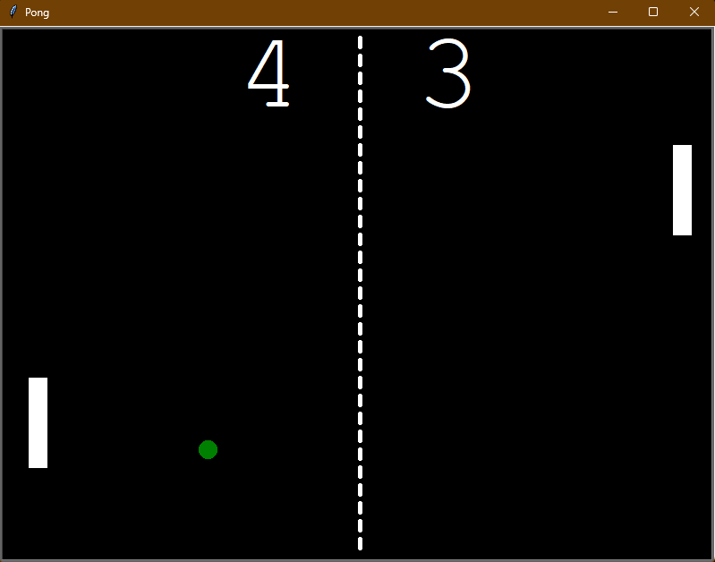

# Pong
A recreation of the classic Pong game in Python using the [Turtle package](https://docs.python.org/3/library/turtle.html).

Inspired by the project for day 22 of the course: [100 Days of Python](https://100daysofpython.dev/).

